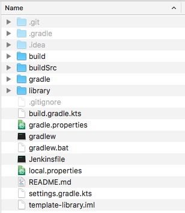
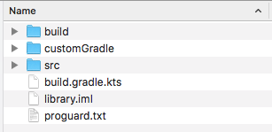
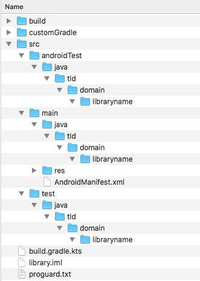

# Bluehexagon Template Library Project

This is a Android template library project.

---------------------------------------------------------------------------------------------------------------------
## Template Information

The idea behind this template library is to create quick as possible a new library that can be used in different 
Android projects as [Composite Builds](https://docs.gradle.org/current/userguide/composite_builds.html).
Android Studio don´t provide a function to create only a new library project.
Can be build with the Jenkins CI to upload the libraryname-0.1.0.aar or the debug libraryname-0.1.0.0-SNAPSHOT.aar to
Artifactory, JCenter or what is needed to publish this new library.
The release build type has a version like major, minor and minor the debug build type has the jenkins build number
after the minor and the suffix `-SNAPSHOT`.

---------------------------------------------------------------------------------------------------------------------

#### Usage

Please follow this steps to setup a new library project base on this template.
Setup in your user directory a folder `.gradle` with a `gradle.properties` file that contains this:

```
artifactory_contextUrl=your artifactory context url
artifactory_user=your username
artifactory_password=your password
```

---------------------------------------------------------------------------------------------------------------------
##### Step one folder renaming

- check out from repository available on Github or Bitbucket
- if you checkout with Android Studio close Android Studio after checkout
- go to the folder that contains the template library `template-library`


- rename the folder `template-library` for your needs to example `template-library => myfancy-library`
- open the folder after rename.
- make hidden files visible



- delete the folders `.git, .gradle, .idea, build` the `.idea` is only available if you check out the repository
with Android Studio or IntelliJ IDEA
- delete the files `template-library.iml` the `template-library.iml` is only available if you check out the repository
with Android Studio or IntelliJ IDEA
- rename the folder `library` to the name of the library to example `library => myfancy`
- after renaming the folder library open this folder



- delete the folders `build`
- delete the files `library.iml` the `library.iml` is only available if you check out the repository
with Android Studio or IntelliJ IDEA



- rename the folders `tld, domain` for your package name to example in my case `tld => de, domain => bluehexagon`
- rename the folder `libraryname` to your library name to example `libraryname => myfancy`

---------------------------------------------------------------------------------------------------------------------
##### Step two customize files

- open the settings.gradle.kts and replace `":library"` with the name in this example `":myfancy"`
- open the AndroidManifet.xml and replace the package attribute with your package name to example `de.bluehexagon.myfancy`
- open the gradle.properties and replace the `library_package_name` with your package name to example `de.bluehexagon.myfancy`